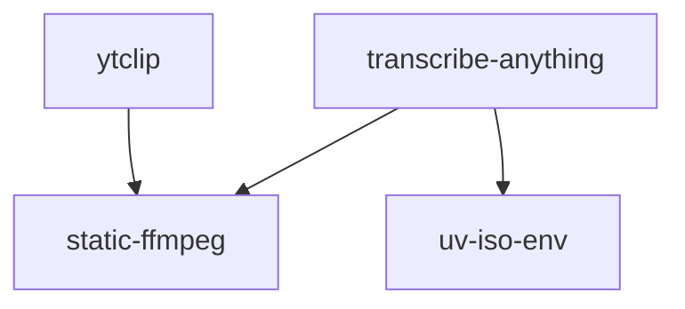

## Zach Vorhies &nbsp;·&nbsp; `zackees`

Ex-Google. I've spent a career getting big software onto constrained hardware — Google Earth
into Audi's in-car navigation, YouTube onto TVs and game consoles. The embedded chapter is
recent: the **FastLED** ecosystem — the library, a Rust build tool, a browser compiler, a video
mapper — and a Rust stack aimed at making C++/embedded builds fast enough to actually iterate in.

---

### The FastLED ecosystem

| Project | Lang | What it is |
| :-- | :-- | :-- |
| **[FastLED](https://github.com/FastLED/FastLED)** | `C++` | The addressable-LED library. [~13,000 commits](https://github.com/FastLED/FastLED/commits?author=zackees) — roughly 17× the next contributor. Current work: parallel-IO channel engines (FlexIO, ObjectFLED, ESP32 PARLIO / LCD_CAM / I2S) driving clockless and SPI modes through one dispatch path. |
| **[fbuild](https://github.com/FastLED/fbuild)** | `Rust` | Multi-platform embedded build tool — compiler, deployer, emulator runner and serial monitor. Reads the `platformio.ini` you already have, builds through a Rust-native pipeline. Effectively sole-authored. `pip install fbuild` |
| **[ledmapper](https://github.com/zackees/ledmapper)** | `TS` | Maps video onto physical WS2812 / APA102 arrays. Live at **[www.ledmapper.com](https://www.ledmapper.com)**. |
| **[fastled-wasm](https://github.com/zackees/fastled-wasm)** | `TS + Rust` | Browser compiler for FastLED sketches — 3-second compile and 1-second deploy on fast machines. `pip install fastled` |

### Developer velocity, in Rust

Everything below exists because C++ and embedded build times are the whole inner loop.

| Project | Lang | What it is |
| :-- | :-- | :-- |
| **[zccache](https://github.com/zackees/zccache)** | `Rust` | Local-first compiler cache for C/C++/Rust/Emscripten — drop-in replacement for sccache and ccache, with a one-line installer and binaries for every platform. |
| **[soldr](https://github.com/zackees/soldr)** | `Rust` | Rust tools delivered as prebuilt, cached artifacts — first run in seconds instead of a cold compile. |
| **[reld](https://github.com/zackees/reld)** | `Rust` | Fork of the `wild` linker aimed at incremental relinking for the inner dev loop — Linux native, Windows/macOS via an lld bridge. Early days. |
| **[running-process](https://github.com/zackees/running-process)** | `Rust` | Subprocess replacement that tracks zombie processes and launches PTYs. Ships to PyPI and crates.io. |
| **[clud](https://github.com/zackees/clud)** | `Rust` | Sandboxed Claude & Codex agent CLI — "safety third and God Mode always." |

### transcribe-anything

Multi-backend Whisper app — blazing fast, Mac-arm optimized, insta-install.
[1,300+ ★](https://github.com/zackees/transcribe-anything) and the most-used standalone tool here.

---

### The Python layer underneath

Older and lower-profile than the work above, and still the highest-traffic thing on the account —
300k+ installs a month.

| Layer | Projects |
| :-- | :-- |
| **Static binaries & toolchains** | [static-ffmpeg](https://github.com/zackees/static_ffmpeg) · [clang-tool-chain](https://github.com/zackees/clang-tool-chain) · [static-sox](https://github.com/zackees/static-sox) · [static-npm](https://github.com/zackees/static-npm) |
| **Environments** | [uv-iso-env](https://github.com/zackees/iso-env) · [setenvironment](https://github.com/zackees/setenvironment) |
| **Media** | [ytclip](https://github.com/zackees/ytclip) · [video-subtitles](https://github.com/zackees/video-subtitles) · [vidcrawler](https://github.com/zackees/vidcrawler) |
| **Systems** | [mimalloc-pprof](https://github.com/zackees/mimalloc-pprof) · [virtual-fs](https://github.com/zackees/virtual-fs) · [rclone-api](https://github.com/zackees/rclone-api) · [memex](https://github.com/zackees/memex) |

How the Python pieces stack

 

Real dependency edges, taken from the published package metadata:

<b>Working with me</b>

 

Open source first — if a client project needs a piece that doesn't exist yet, it usually ends up
on this profile as a standalone package with tests, CI and a release. That's why there are 200+
repos here, and why some of the smallest ones carry the most traffic.

Based in San Francisco.

