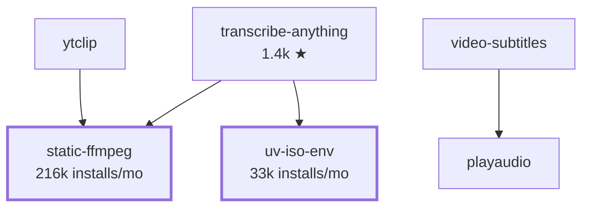

## Zach Vorhies &nbsp;·&nbsp; `zackees`

Embedded systems, and the build tooling underneath them. The last three years have gone into two
connected things: the **FastLED** ecosystem — the library, a Rust build tool, a browser compiler,
a video mapper — and a Rust stack aimed at making C++/Rust builds fast enough to actually iterate
in.

---

### The FastLED ecosystem

| Project | | |
| :-- | :-- | :-- |
| **[FastLED](https://github.com/FastLED/FastLED)** | `C++` | The addressable-LED library — 7.4k ★, 1.7k forks. [12,923 commits](https://github.com/FastLED/FastLED/commits?author=zackees), roughly 17× the next contributor. Current work: parallel-IO channel engines (FlexIO, ObjectFLED, ESP32 PARLIO / LCD_CAM / I2S) driving clockless and SPI modes through one dispatch path. |
| **[fbuild](https://github.com/FastLED/fbuild)** | `Rust` | Fast multi-platform compiler, deployer, emulator runner and serial monitor for embedded. Reads the `platformio.ini` files you already have, then builds through a Rust-native pipeline. 1,180 of its 1,182 commits. |
| **[ledmapper](https://github.com/zackees/ledmapper)** | `TypeScript` | Maps video onto physical WS2812 / APA102 arrays. Live at **[www.ledmapper.com](https://www.ledmapper.com)**. |
| **[fastled-wasm](https://github.com/zackees/fastled-wasm)** | `TypeScript` | Browser compiler for FastLED sketches — 3-second compile, 1-second deploy. |

### Build velocity, in Rust

Everything below exists because embedded and C++ build times are the whole inner loop.

| Project | | |
| :-- | :-- | :-- |
| **[zccache](https://github.com/zackees/zccache)** | `Rust` | Local-first compiler cache for C/C++/Rust/Emscripten — drop-in replacement for sccache and ccache. |
| **[soldr](https://github.com/zackees/soldr)** | `Rust` | Makes Rust tools appear instantly; caching makes the build finish instantly. |
| **[reld](https://github.com/zackees/reld)** | `Rust` | relink · reweld · reload — a cross-platform incremental linker built for the inner dev loop, not for release builds. |
| **[running-process](https://github.com/zackees/running-process)** | `Rust` | Subprocess replacement that tracks zombie processes and launches PTYs. Ships to PyPI, [36k installs/month](https://pypi.org/project/running-process/). |
| **[clud](https://github.com/zackees/clud)** | `Rust` | Claude & Codex CLI, with safety third and God Mode always. |

### transcribe-anything

Multi-backend Whisper app — blazing fast, Mac-arm optimized, insta-install.
[1,392 ★](https://github.com/zackees/transcribe-anything), and the most-used standalone tool here.

---

### The Python layer underneath

Older and lower-profile than the work above, and still the highest-traffic thing on the account —
roughly **333k installs a month** across 21 packages.

| Layer | Projects |
| :-- | :-- |
| **Static binaries** | [static-ffmpeg](https://github.com/zackees/static_ffmpeg) · [static-sox](https://github.com/zackees/static-sox) · [static-npm](https://github.com/zackees/static-npm) |
| **Environments** | [iso-env](https://github.com/zackees/iso-env) · [setenvironment](https://github.com/zackees/setenvironment) |
| **Media** | [ytclip](https://github.com/zackees/ytclip) · [video-subtitles](https://github.com/zackees/video-subtitles) · [vidcrawler](https://github.com/zackees/vidcrawler) |
| **Systems** | [mimalloc-pprof](https://github.com/zackees/mimalloc-pprof) · [virtual-fs](https://github.com/zackees/virtual-fs) · [rclone-api](https://github.com/zackees/rclone-api) · [memex](https://github.com/zackees/memex) |

How the Python pieces stack

 

Real dependency edges, taken from the published package metadata:

---

### By the numbers

<b>Working with me</b>

 

Open source first — if a client project needs a piece that doesn't exist yet, it usually ends up
on this profile as a standalone package with tests, CI and a release. That's why there are 200+
repos here, and why some of the smallest ones carry the most traffic.

Based in San Francisco.

