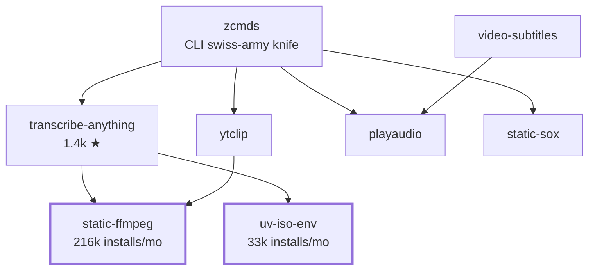

## Zach Vorhies &nbsp;·&nbsp; `zackees`

I build the load-bearing pieces other people's apps stand on — static binaries, isolated
environments, process wrappers, build caches — so that shipping doesn't turn into dependency
archaeology. Most of it is open source. A lot of it is already sitting at the bottom of
somebody's `requirements.txt`.

---

### FastLED

Top contributor to **[FastLED](https://github.com/FastLED/FastLED)** — the addressable-LED
library that runs on basically anything with a GPIO pin.

[**12,923 commits**](https://github.com/FastLED/FastLED/commits?author=zackees) — roughly 17×
the next contributor. Recent work: parallel-IO channel engines (FlexIO, ObjectFLED, ESP32
PARLIO / LCD_CAM / I2S) running clockless and SPI modes through one dispatch path, plus
[fastled-wasm](https://github.com/zackees/fastled-wasm) — a browser compiler for FastLED
sketches: 3-second compile, 1-second deploy.

---

### The building blocks

Everything below is a real dependency edge, not a theme — `transcribe-anything`, `ytclip` and
`zcmds` all stand on the same base layer.

| Layer | Projects |
| :-- | :-- |
| **Static binaries** | [static-ffmpeg](https://github.com/zackees/static_ffmpeg) · [static-sox](https://github.com/zackees/static-sox) · [static-npm](https://github.com/zackees/static-npm) |
| **Environments & processes** | [iso-env](https://github.com/zackees/iso-env) · [isolated-environment](https://github.com/zackees/isolated-environment) · [running-process](https://github.com/zackees/running-process) · [setenvironment](https://github.com/zackees/setenvironment) |
| **Media** | [transcribe-anything](https://github.com/zackees/transcribe-anything) · [ytclip](https://github.com/zackees/ytclip) · [video-subtitles](https://github.com/zackees/video-subtitles) |
| **Build velocity (Rust)** | [soldr](https://github.com/zackees/soldr) · [zccache](https://github.com/zackees/zccache) · [clud](https://github.com/zackees/clud) |
| **Systems** | [mimalloc-pprof](https://github.com/zackees/mimalloc-pprof) · [virtual-fs](https://github.com/zackees/virtual-fs) · [rclone-api](https://github.com/zackees/rclone-api) |
| **Everyday driver** | [zcmds](https://github.com/zackees/zcmds) · [aicode](https://github.com/zackees/aicode) |

---

### By the numbers

<b>Working with me</b>

 

Open source first — if a client project needs a piece that doesn't exist yet, it usually ends
up on this profile as a standalone package with tests, CI and a PyPI release. That's why there
are 200+ repos here and why the small ones get the download traffic.

Based in San Francisco.

